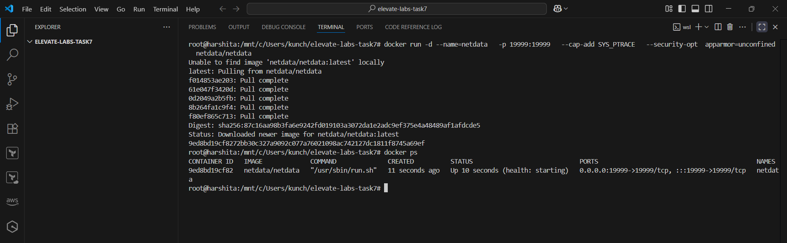
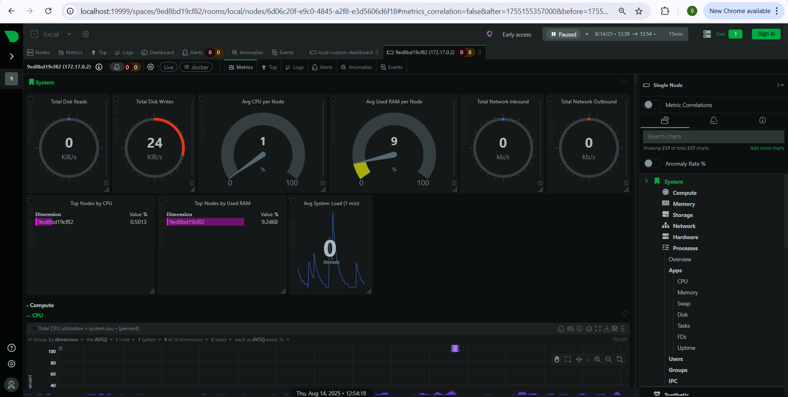
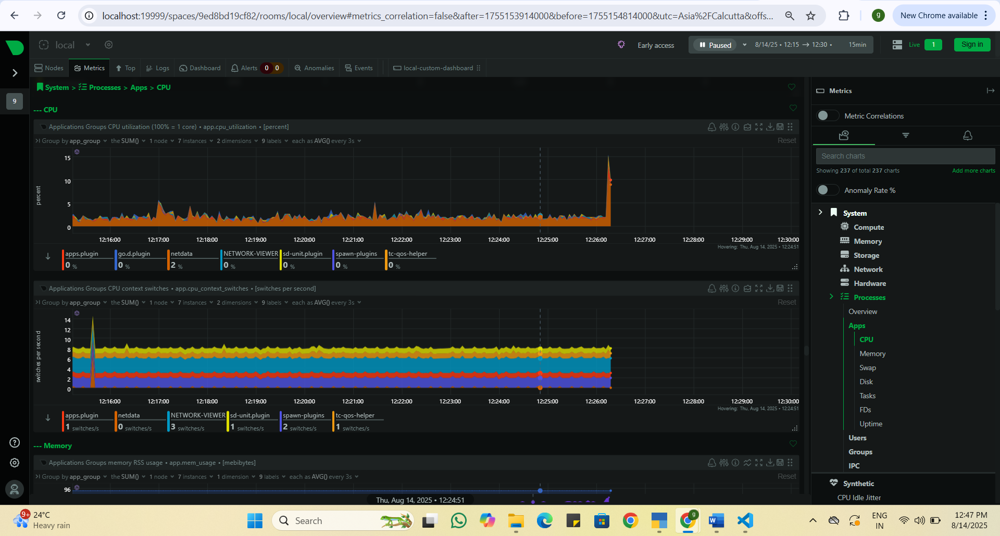
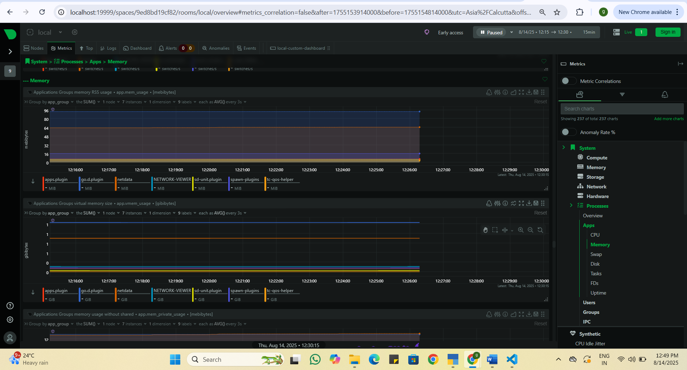
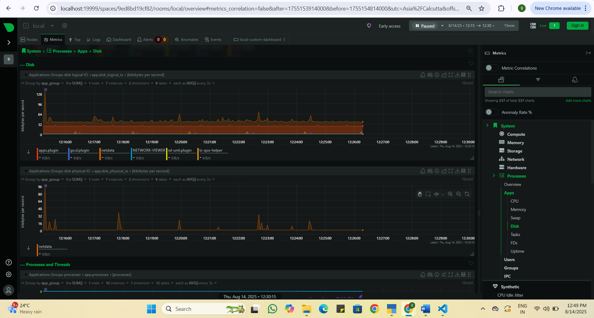
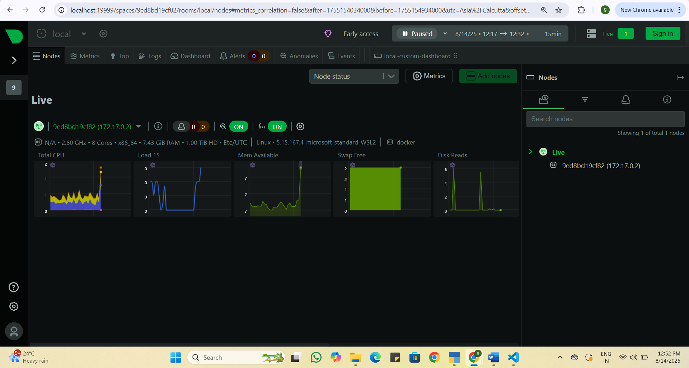
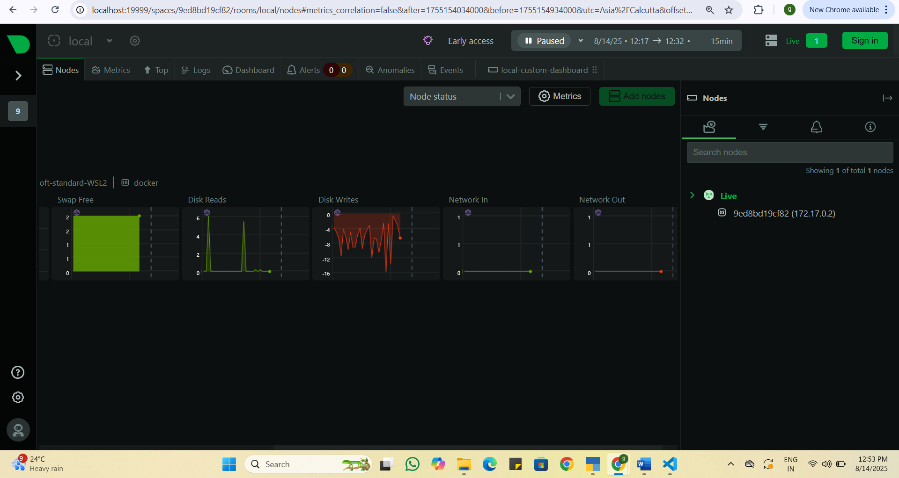

# Task 7 – Monitor System Resources Using Netdata

## 📌 Objective
Install and configure **Netdata** to visualize system and application performance metrics in real time.

---

## 🛠 Tools Used
- **Netdata** – Free, open-source monitoring tool
- **Docker** – Containerized Netdata deployment
- **Browser** – For dashboard access (http://localhost:19999)

---

## 📖 Steps to Implement

### 1️⃣ Run Netdata in Docker
```bash
docker run -d --name=netdata \
  -p 19999:19999 \
  --cap-add SYS_PTRACE \
  --security-opt apparmor=unconfined \
  netdata/netdata
```

---

##  2️⃣ Access the Dashboard

 - Open your browser and visit:
   ```bash 
   http://localhost:19999
   ```

 - You will see a real-time monitoring dashboard.


## 3️⃣ Explore Metrics

 - CPU Usage – % user, % system, load averages.

 - Memory Usage – Used, free, cached, buffers.

 - Disk I/O – Read/write throughput, IOPS.

 - Docker Containers – Resource usage per container.

 - Alerts Panel – Active warnings or critical alerts.


## 4️⃣ View Logs

```bash
docker exec -it netdata bash
cd /var/log/netdata
ls
cat error.log
```

---

📸 Screenshots

Netdata Installed & Container is Running


🖥 System Overview


⚙ CPU Metrics


💾 Memory Metrics


📀 Disk Metrics


🐳Live Docker Container Metrics


---

## 🎯 Outcome

 - Successfully installed and ran Netdata in Docker.

 - Monitored CPU, RAM, Disk, and Docker container metrics in real time.

 - Understood lightweight monitoring for servers and applications.

---

## 📬 Contact
**Nikki Goyal** – DevOps Intern  
📧 Email: nikkigoyal679@gmail.com  
🔗 LinkedIn: [Nikki Goyal](https://www.linkedin.com/in/nikki-goyal-devops)

---